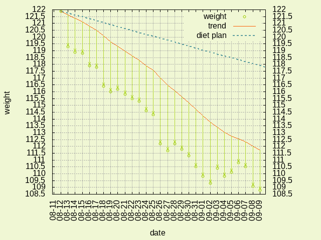
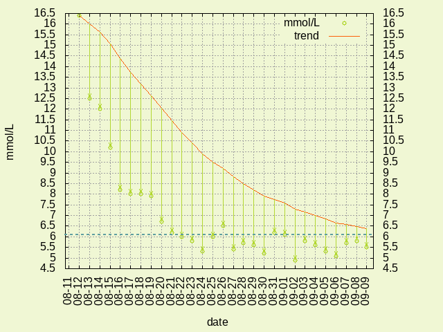

# hd

## scripts:

_mprocess_ - calculate blood sugar level data trend   
_wprocess_ - calculate weight data trend   
_mplot_ - plot blood sugar level data   
_wplot_ - plot weight data   

## data:

_mmolL_ - blood sugar level measurements   
_weight_ - weight measurements   
_mprocessed_ - mmol/L data with added exponentially smoothed moving average with 10% smoothing   
_wprocessed_ - weight data with added exponentially smoothed moving average with 10% smoothing   

## plots

_weight.png_ - weight data plot   
_mmolL.png_ - blood sugar level plot   

