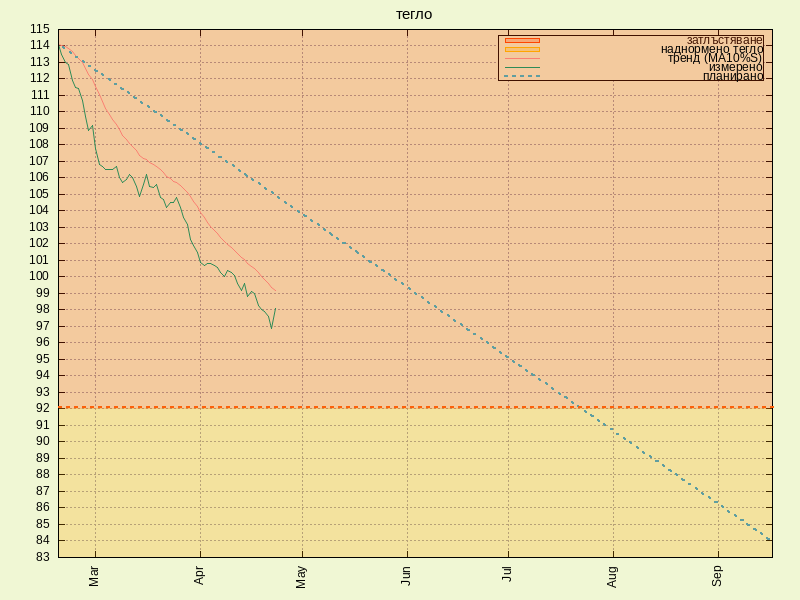
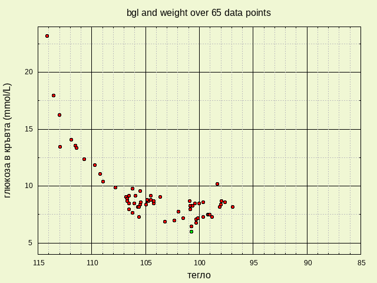

# my if-sugarfree jorney  

   
   
   

## scripts:

_scripts/slac_ - draw sleep and activity    
_scripts/wlbs_ - draw weight loss and blood sugar level   
_scripts/bp_ - draw blood presure and heart rate data  

## data:

_data/data_ - weight and blood sugar level measurements   
_data/processed_ - weight and bsl data with exponentially smoothed moving average with 10% smoothing and BMI   
_data/diet_ - diet plan   
_data/bp_ - blood pressure measurements   
_data/2018NN_ - monthly sleep & activity data   
_data/langpack_ - translation pack   

## plots:

_plots/dataplot.png_ - last 31 days weight loss and bs data plot  
_plots/weight.png_ - last 31 days weight loss   
_plots/2018NN.png_ - current month sleep & steps data plot  
_plots/weightbsl.png_ - relation between weight loss and bsl   
_plots/progress.png_ - overall weight loss progress plot   

## links:

[Letter on Corpulence, Addressed to the Public, by William Banting](https://archive.org/details/letteroncorpulen00bant/page/n3)   
[The Hacker's Diet, How to lose weight and hair through stress and poor nutrition By John Walker](http://www.fourmilab.ch/hackdiet/)  
[IF on Reddit](https://www.reddit.com/r/intermittentfasting/wiki/index)   
[Diet Doctor - A low-carb diet for beginners](https://www.dietdoctor.com/low-carb)   
[Sugar: The Bitter Truth](https://www.youtube.com/watch?v=dBnniua6-oM)   
[Sugar Coated Documentary](https://www.youtube.com/watch?v=4bJ2lpapwH4)   
[Sugar is Not a Treat, Jody Stanislaw, TEDxSunValley](https://www.youtube.com/watch?v=tic7X3ET4gE)   
[Jason Fung, MD on IF](https://www.youtube.com/watch?v=v9Aw0P7GjHE)   
[The mathematics of weight loss, Ruben Meerman, TEDxQUT](https://www.youtube.com/watch?v=vuIlsN32WaE)   
[No Sugar](https://www.facebook.com/Nooosugar/)   
[NUT Nutrition Software](http://nut.sourceforge.net/)    
