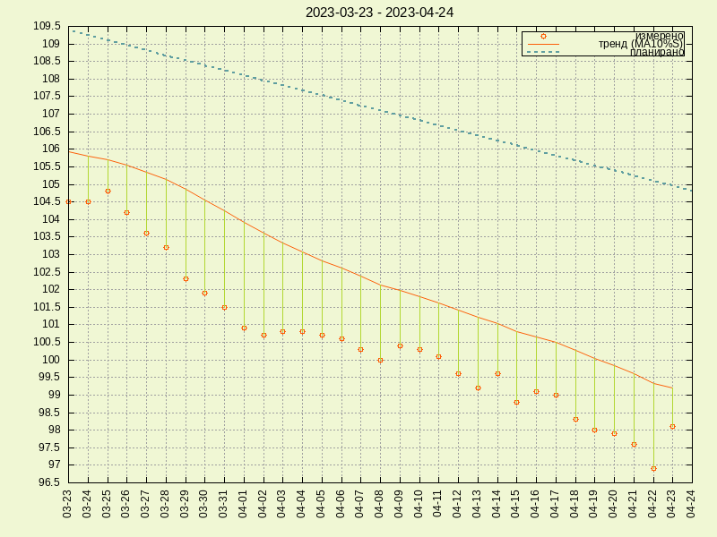

# my lchf-sugarfree-if journey

## scripts:

_scripts/mprocess_ - calculate blood sugar level data trend   
_scripts/wprocess_ - calculate weight data trend   
_scripts/mplot_ - plot blood sugar level data   
_scripts/wplot_ - plot weight data   

## data:

_data/mmolL_ - blood sugar level measurements   
_data/weight_ - weight measurements   
_data/mprocessed_ - mmol/L data with added exponentially smoothed moving average with 10% smoothing   
_data/wprocessed_ - weight data with added exponentially smoothed moving average with 10% smoothing   
_data/diet_ - diet plan

## plots:

_plots/weight.png_ - weight data plot   
_plots/mmolL.png_ - blood sugar level plot   

## links:

[The Hacker's Diet, How to lose weight and hair through stress and poor nutrition By John Walker](http://www.fourmilab.ch/hackdiet/)  
[Diet Doctor - A low-carb diet for beginners](https://www.dietdoctor.com/low-carb)   
[No Sugar](https://www.facebook.com/Nooosugar/)   
[NUT Nutrition Software](http://nut.sourceforge.net/)    
[IF on Reddit](https://www.reddit.com/r/intermittentfasting/wiki/index)   
[Jason Fung, MD on IF](https://www.youtube.com/watch?v=v9Aw0P7GjHE)
