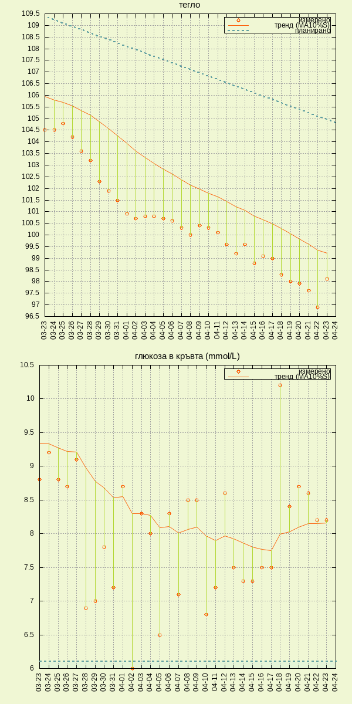

# my lchf-sugarfree-if journey

   

## scripts:

_scripts/process_ - calculate trends from raw data   
_scripts/plot_ - plot data for last 31 days   

## data:

_data/data_ - weight and blood sugar level measurements
_data/processed_ - weight and bsl data with added exponentially smoothed moving average with 10% smoothing and BMI   
_data/diet_ - diet plan

## plots:

_plots/dataplot.png_ - last 31 days data plot   

## links:

[The Hacker's Diet, How to lose weight and hair through stress and poor nutrition By John Walker](http://www.fourmilab.ch/hackdiet/)  
[Diet Doctor - A low-carb diet for beginners](https://www.dietdoctor.com/low-carb)   
[No Sugar](https://www.facebook.com/Nooosugar/)   
[NUT Nutrition Software](http://nut.sourceforge.net/)    
[IF on Reddit](https://www.reddit.com/r/intermittentfasting/wiki/index)   
[Jason Fung, MD on IF](https://www.youtube.com/watch?v=v9Aw0P7GjHE)   
[Sugar Coated Documentary](https://www.dailymotion.com/video/x61x56l)   
[Sugar is Not a Treat, Jody Stanislaw, TEDxSunValley](https://www.youtube.com/watch?v=tic7X3ET4gE)   
[The mathematics of weight loss, Ruben Meerman, TEDxQUT](https://www.youtube.com/watch?v=vuIlsN32WaE)   
[Sugar: The Bitter Truth](https://www.youtube.com/watch?v=dBnniua6-oM)
